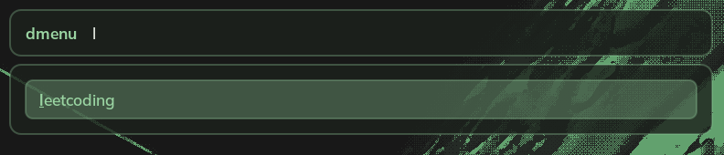

# Configuration

Example configuration:

```toml
[workspaces]
dmenu_command = "rofi -dmenu"
task_delay = 0.8
```

- **`dmenu_command`**: The command used to launch your workspace picker. In this example, we use `rofi`, a popular alternative to `dmenu`. _(default: "rofi -dmenu")_
- **`task_delay`**: Interval (in seconds) between actions when opening a workspace. For example, `0.8` waits 0.8 seconds between tasks. _(default: 0.8)_

## Defining Workspaces

Workspaces are defined under `[workspaces.items]`. Example:

```toml
[workspaces.items]
"leetcoding" = [
  { workspace = 1, run = 'footclient -e fish -c "nvim; fish"' },
  { workspace = 1, run = "brave --new-window https://leetcode.com/ https://neetcode.io/", task_delay = 2.0},
]
```

Your rofi menu will look like this:



And when you select the `leetcoding` workspace.

1. Open a `fish` terminal running `nvim` in workspace 1.
2. Make the terminal window full screen.
3. Open Brave Browser with [https://leetcode.com/](https://leetcode.com/) and [https://neetcode.io/](https://neetcode.io/) in workspace 1.
4. Wait for Brave to open for 2 seconds.
5. Make the browser window full screen.

# Usage

Run the command:

```
niri-workspaces
```

This will open your workspace picker using `dmenu`, `rofi`, or whatever command you specified in the configuration.
